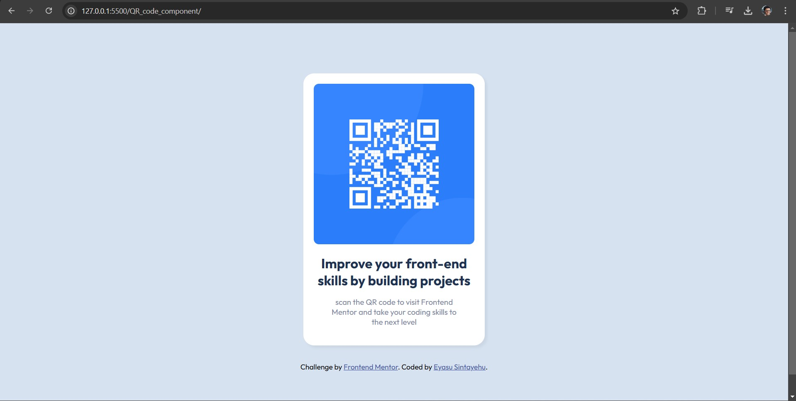

# Frontend Mentor - QR code component

## Design preview for the QR code component coding challenge Welcome! 👋

## Table of contents

- [Screenshot](#screenshot)
- [Links](#links)
- [Built with](#built-with)
- [Author](#author)

### Screenshot

### Links

- Solution URL: [Add solution URL here](https://your-solution-url.com)
- Live Site URL: [Add live site URL here](https://your-live-site-url.com)

### Built with

- Semantic HTML5 markup
- CSS custom properties

### Author

Eyasu sintayehu: [Github](https://github.com/TheSecondChance)
